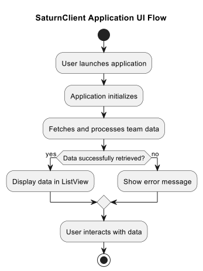

# SaturnClient Project Documentation

## Overview

SaturnClient is a desktop client application implemented in C# to interface with the SaturnService. It fetches and processes NFL team statistics, displaying the data in a user-friendly format. The application is designed with object-oriented principles to ensure robustness and maintainability.

## User Interface Flow

The SaturnClient application offers a straightforward and intuitive user interface, allowing users to interact with the system to view NFL team statistics effectively. Here's a step-by-step guide to the application's UI flow:

1. **Application Launch**: When the user launches the SaturnClient application, the `MainWindow` is presented, initiating the data retrieval process automatically.

2. **Data Fetching**: Upon initialization, the application communicates with the SaturnService to enqueue data processing for all teams and fetch the processed statistics. During this period, a central `ProgressBar` indicates that data fetching and processing are in progress.

3. **Data Display**: Once the data is retrieved, the application populates a `ListView` with the team statistics, displaying columns for team name, team number, score, and game date. This table provides a comprehensive view of the team stats, allowing users to grasp the information at a glance.

4. **Interaction**: Users can interact with the `ListView` to scroll through the data. While the current implementation is read-only, future enhancements may include sorting, filtering, and more detailed data exploration.

5. **Error Handling**: In case of any errors during data retrieval or processing, the user is promptly informed via a message box, ensuring transparency and immediate feedback on any issues encountered.

This seamless flow ensures that users can efficiently access and understand the NFL team statistics without unnecessary complexity or manual intervention.

## Asynchronous Operations and UI Integration

### Data Fetching and Display:

- **FetchAndDisplayTeamData Method**: Initiates data fetching when the application starts, showing a `ProgressBar` to indicate activity.
    ```csharp
    private async void FetchAndDisplayTeamData()
    ```
- **Data Retrieval**: Asynchronously calls `EnqueueAllTeamsAndGetCorrelationIds` to enqueue teams and `FetchAllProcessedData` to fetch team statistics.
- **UI Update**: Populates `lvTeamData` with fetched data, updating the UI on the main thread and hiding the `ProgressBar` upon completion.

### HTTP Requests and Data Processing:

- **Asynchronous HTTP Calls**: Utilizes `HttpClient` for asynchronous POST and GET requests to retrieve team data.
    ```csharp
    private async Task<Dictionary<int, string>> EnqueueAllTeamsAndGetCorrelationIds()
    private async Task<List<TeamStat>> FetchProcessedData(string correlationId)
    ```
- **Retry Mechanism**:
    - `RetryOnConditionAsync`: Implements a retry policy for asynchronous operations, enhancing data fetching resilience.
        ```csharp
        public static async Task<T> RetryOnConditionAsync<T>(
            Func<Task<T>> operation, 
            Func<T, bool> condition, 
            int maxRetryCount = 3, 
            TimeSpan? delay = null)
        ```

### UI Updates:

- Ensures that all updates to the UI, such as displaying data and controlling the visibility of UI elements, occur on the main thread to maintain responsiveness and prevent errors.

This structured approach to detailing asynchronous operations provides a clear and concise overview of how SaturnClient manages async processes and UI interactions, ensuring a smooth user experience.

## Features

- **Interactive User Interface**: Provides a graphical interface for users to view NFL team statistics.
- **Data Retrieval**: Communicates with SaturnService to fetch data asynchronously.
- **Retry Mechanism**: Implements a retry policy for robust error handling and data fetching resilience.
- **Logging**: Incorporates logging for monitoring operations and errors.

## Non-Functional Requirements

1. **Language**: The client is implemented in C#, an object-oriented programming language.
2. **Robustness**: The system is designed to handle unexpected inputs seamlessly.
3. **System Design**: Utilizes object-oriented design principles for flexibility and clarity.
4. **Maintainability**: Detailed module documentation and maintenance history are provided for easy system maintenance.
5. **Reusability**: The architecture encourages reusability through modular and cohesive design.

## Client Operation

Upon launch, the application performs the following operations:
1. Sends requests to enqueue team data for processing.
2. Retrieves and displays the processed team data.

## Error Handling

The client has a robust error handling strategy, including:
- A retry policy for transient failures.
- Comprehensive logging to facilitate troubleshooting.

## Reusability and Extensibility

With its modular design, SaturnClient can be extended to include more features or integrate with other services in the future.

## Service Repository

The SaturnService codebase is hosted on GitHub and can be accessed at the following repository:

[SaturnClient Repository](https://github.com/ergutierz/SaturnService.git)

For further details on the implementation or to contribute to the project, please visit the repository.

## Design and Implementation

### Client Architecture

The client's architecture includes several key components:
- **MainWindow**: Serves as the primary interface for user interaction.
- **RetryPolicy**: Provides a mechanism to retry operations based on specific conditions.
- **TeamStat**: Represents the data structure for NFL team statistics.

## System Model


